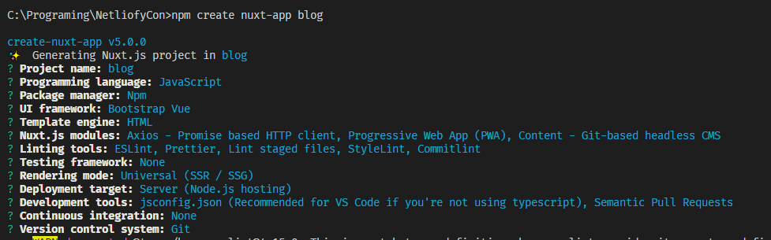
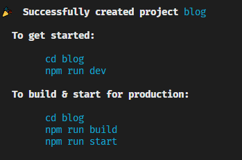
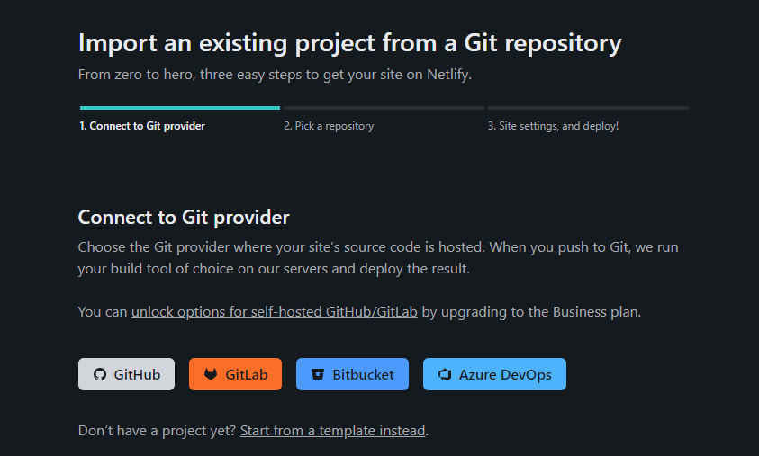
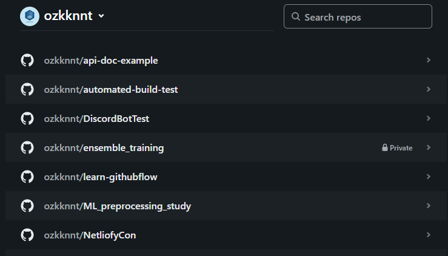
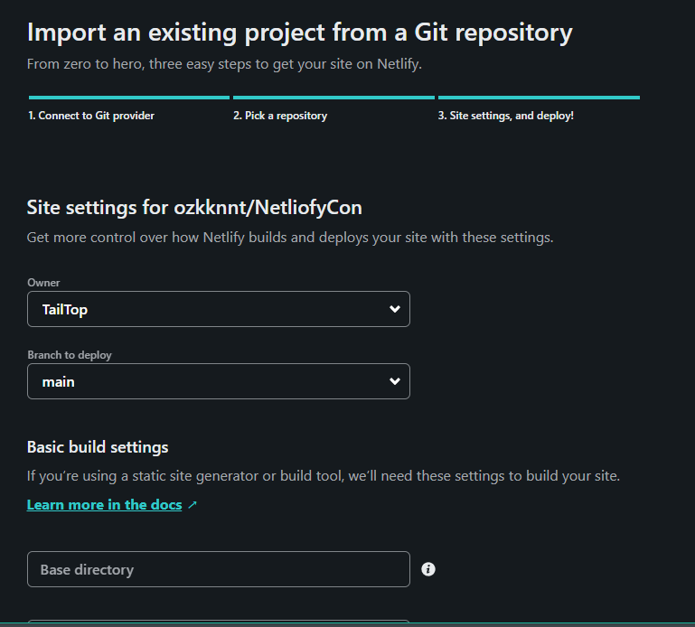
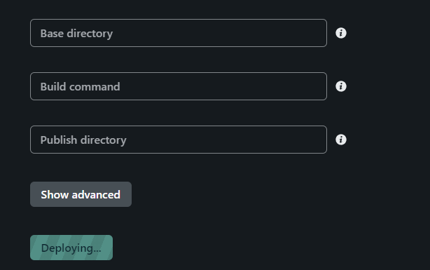

# NetliofyCon

```
npm create nuxt-app blog
```






# Netlifyとの連携











# Netlifyへのデプロイ方法  
https://nuxtjs.org/deployments/netlify/#how-to-deploy-on-netlify-  

* 動画  
https://explorers.netlify.com/learn/get-started-with-nuxt/nuxt-generate-and-deploy  

動画が一番わかりやすい


